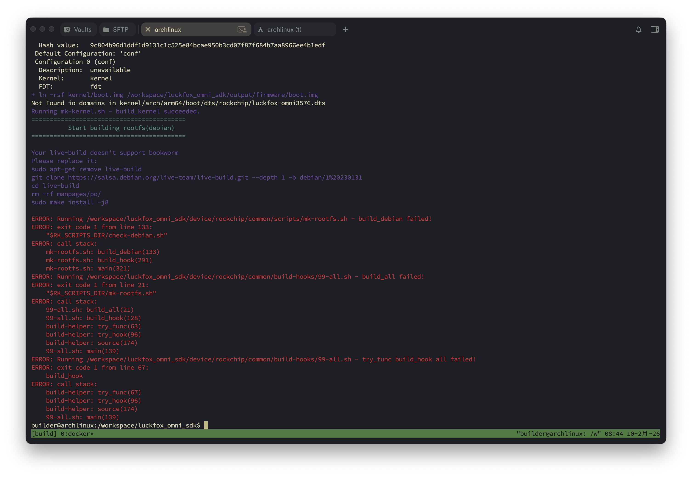

编译debian12镜像时，会出现这个问题


实测按照它的要求操作就行

```bash
Running mk-kernel.sh - build_kernel succeeded.
==========================================
          Start building rootfs(debian)
==========================================

Your live-build doesn't support bookworm
Please replace it:
sudo apt-get remove live-build
git clone https://salsa.debian.org/live-team/live-build.git --depth 1 -b debian/1%20230131
cd live-build
rm -rf manpages/po/
sudo make install -j8
```